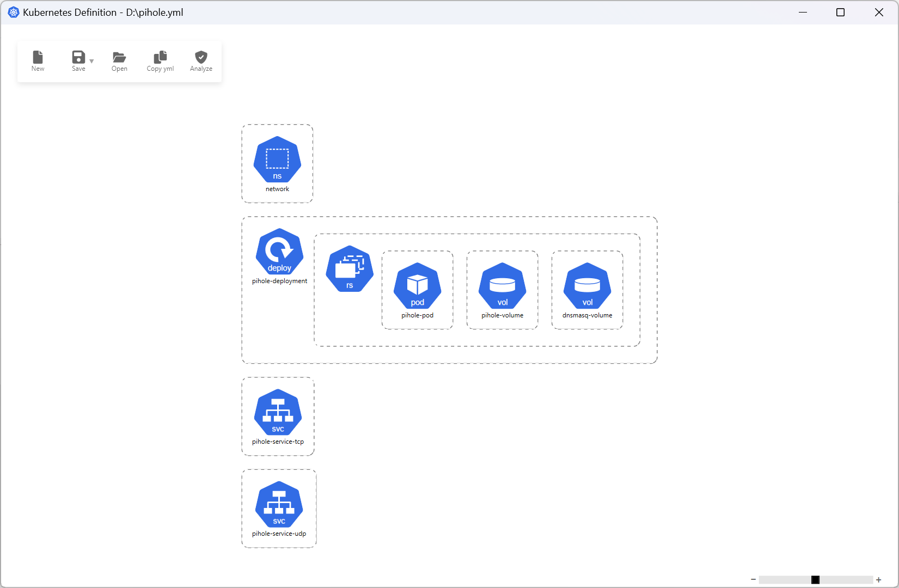

Hto3 Kubernetes Definition
========================================

This application is a Windows graphical user interface (GUI) to edit Kubernetes yml files, describing Kubernetes Objects. More info at [this link](https://kubernetes.io/docs/concepts/overview/working-with-objects/kubernetes-objects/).

The amount of Kubernetes objects is huge and they change along the time, so this project intents do cover the most popular ones, please do not expect all possible scenarios. We encorage you to contribute to this project with your merge request, either improving an existing implementation or providing support for new objects.

### How to support a new object?

Follow these [instructions](docs/NEW_OBJECT.md).