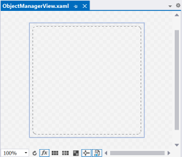

Providing support to a new Kubernetes object
========================================

First of all get clearly in your mind which object you are going to support, before any action, check the table below:

| Question                                                                               | Action                                                                                                                           |
|----------------------------------------------------------------------------------------|----------------------------------------------------------------------------------------------------------------------------------|        
|This object already exists?                                                             | Check it out testing the application. If doesn't exists, go ahead to development.                                                |
|The object looks like it exists but it doesn't provide some settings. What should i do? | You will have to insert an object in the middle of current structure or modify an existing object to provide some missing setting. |

## Choose an icon

Choose a svg icon like this example:


The size doesn't matter, since svg files are vectors. Anyway try to follow the same pattern of the existing ones (color, shape, style, look and feel).
 
On project **Hto3.KubernetesDefinition.UI**, put in the folder `/Resources/Gliphs` and choose the build action as **Resource**.

## Create the ViewModel

On project **Hto3.KubernetesDefinition.UI**, create a class in the folder `/ViewModels`, follow the name pattern `YourObjectNameViewModel` where the **YourObjectName** you should change with the desired name.

Proceed with these changes:
* Make it public.
* Inherit from `: EditorViewModel`
* Generate the constructor `public YourObjectNameViewModel(IMvxNavigationService navigationService, IViewModelMapper<TheRealK8sClass, YourObjectNameViewModel> viewModelMapper, IMvxMessenger messenger) : base(navigationService, viewModelMapper, messenger) { }`
  - Change the type **TheRealK8sClass** from the class name that represents the Kubernetes object found in namespace `Hto3.KubernetesDefinition.Models.KubernetesObjects`.
* Above the namespace line, put the attribute `[assembly: MvxNavigation(typeof(YourObjectNameViewModel), "/Views/YourObjectNameView")]`.

The final result will be something like:

```C#
using Hto3.KubernetesDefinition.UI.Common;
using Hto3.KubernetesDefinition.UI.ViewModels;
using MvvmCross.Navigation;
using MvvmCross.Plugin.Messenger;
using Hto3.KubernetesDefinition.Models.KubernetesObjects;
using System;
using System.Collections.Generic;
using System.Linq;
using System.Text;
using System.Threading.Tasks;

[assembly: MvxNavigation(typeof(YourObjectNameViewModel), "/Views/YourObjectNameView")]
namespace Hto3.KubernetesDefinition.UI.ViewModels
{
    public class YourObjectNameViewModel : EditorViewModel
    {
        public YourObjectNameViewModel(IMvxNavigationService navigationService, IViewModelMapper<TheRealK8sClass, YourObjectNameViewModel> viewModelMapper, IMvxMessenger messenger)
            : base(navigationService, viewModelMapper, messenger)
        {
        }
    }
}
```

Now you are free to include properties in this class to represent the fields that your object contains. Use simple properties like:
```C#
public String MyField { get; set; }
```
It will fire notifying as property changed as expected. The project is using the [PropertyChanged](https://github.com/Fody/PropertyChanged) library, check it out for documentation.

## Create the View

On project **Hto3.KubernetesDefinition.UI**, create a Window (WPF) in the folder `/View`, follow the name pattern `YourObjectNameView` where the **YourObjectName** you should change to the desired name.

Proceed with these changes:
* Add the xaml namespace `xmlns:common="clr-namespace:Hto3.KubernetesDefinition.UI.Common"` and `xmlns:viewModels="clr-namespace:Hto3.KubernetesDefinition.UI.ViewModels"`.
* Change the root element from `Window` to `common:EditorViewBaseWindow`.
* [Optional but recommended] Change the main panel element from `Grid` to `Canvas`.
* In the code-behind, inherit from `EditorViewBaseWindow` from namespace `Hto3.KubernetesDefinition.UI.Common`, instead of Window.
* Decorate the code-behind class with the annotations `[MvxWindowPresentation]` and `[MvxViewFor(typeof(YourObjectNameViewModel))]`.
* Apply a design time DataContext with the property `d:DataContext="{d:DesignInstance {x:Type viewModels:YourObjectNameViewModel}}"` on the root element `common:EditorViewBaseWindow`.

Now you are ready to design the visualizaion. Use databinding as recommended practice from the MVVM pattern. 

## Create the Object Metadata

On project **Hto3.KubernetesDefinition.UI**, create a class in the folder `/ObjectMetadata`, follow the name pattern `YourObjectNameMetadata` where the **YourObjectName** you should change with the desired name.

Proceed with these changes:
* Make it public.
* Implement the interface `: IObjectMetadataUI`

Example:

```C#
public class DeploymentMetadata : IObjectMetadataUI
{
    public String EditorPath => "/Views/DeploymentView";
    public String IconName => "deploy.svg";
    public String Name => "Deployment";
    public String Description => "Deployment enables declarative updates for Pods and ReplicaSets.";
    public Type KubernetesObjectType => typeof(Models.KubernetesObjects.Deployment);
    public Type ManagerType => typeof(DeploymentObjectManagerViewModel);
    public Boolean Unique => false;
}
```

At this moment you may not have the `ManagerType`, leave it as null, it will be our next step. Remember to back here and fill the type.

## Create the Object Manager ViewModel

The next step is make your kubernetes object to be available at some point of the object tree. The ViewModel that we are going to create acts like a manager who knows how to handle some operations. Although most of he abilities will be inherited, it will know to remove and add children objects as being the ViewModel of the **ObjectManagerView.xaml**. So this time you doesn't need to worry about the View, just the ViewModel. 



To accomplish that, on project **Hto3.KubernetesDefinition.UI**, create a class in the folder `/ViewModels`, follow the name pattern `YourObjectNameManagerViewModel` where the **YourObjectName** you should change with the desired name.

Proceed with these changes:
* Make it public.
* Inherit from `: ObjectManagerViewModel`
* The parent class will require you to generate a constructor, proceed as it requires.
* Inside the constructor, set `base.Metadata = new YourObjectNameMetadata();`.

### Will your Object have children?

If so, override two methods `ResolveKubernetesObjectChildren` and `ResolveVisualizationChildren` and implement as below table instructions:

| ResolveKubernetesObjectChildren                  |  ResolveVisualizationChildren |
|--------------------------------------------------|-------------------------------|
| Here you will need to put the children instances where they need to be in the official kubernetes object structure. To accomplish it, unbox the `base.KubernetesDataObject` to the real type and looking into the `base.ChildrenKubernetesDataObjectsobject` get the childrens and put to the proprety where they should belong to. | Here you will need to add childrens to the ViewModels tree, think that you are going to build the visual structure of blocks. So explore the `base.KubernetesDataObject` by unboxing it to the real type, then for each children object, call the AddCommand `base.AddCommand`. |

There is no better way to explain how to do this step as peek into already implemented classes, so check it out for examples.

Next, override the method `Prepare` to add the options to execute, that is the context menu to add new children. Example:

```C#
public override void Prepare()
{
    base.Prepare();

    base.OptionsToExecute.Add(null);
    base.OptionsToExecute.Add(base.CreateAddMenuOption<PodMetadata>());
    base.OptionsToExecute.Add(base.CreateAddMenuOption<VolumeMetadata>());
}
```

## Create the View Model Mapper

On project **Hto3.KubernetesDefinition.UI**, create a class in the folder `/ObjectMappers`, follow the name pattern `YourObjectNameViewModelMapper` where the **YourObjectName** you should change with the desired name. It's time to map the real Kubernetes object to your ViewModel and vice versa.

Proceed with these changes:
* Make it public.
* Implement the generic interface `: IViewModelMapper<TheRealK8sClass, YourObjectNameViewModel>`

Here you will implement two methods `From ConvertBack(To source)` and `void Fill(From source, To target)` and the non-generic flavors of the same. Follow the below table:

| ConvertBack                  |  Fill |
|------------------------------|-------|
| Bring back the real Kubernetes Object from the view model. Create a new instance of the Kubernetes object and fill all supported fields. | Fill the view model from a Kubernetes Object. |

There is no better way to explain how to do this step as peek into already implemented classes, so check it out for examples.

## Dependency Injection

On project **Hto3.KubernetesDefinition.UI**, include the mapper in the file **DependencyInjection.cs**:

```C#
Mvx.IoCProvider.RegisterType<IViewModelMapper<TheRealK8sClass, YourObjectNameViewModel>, YourObjectNameViewModelMapper>();
```
